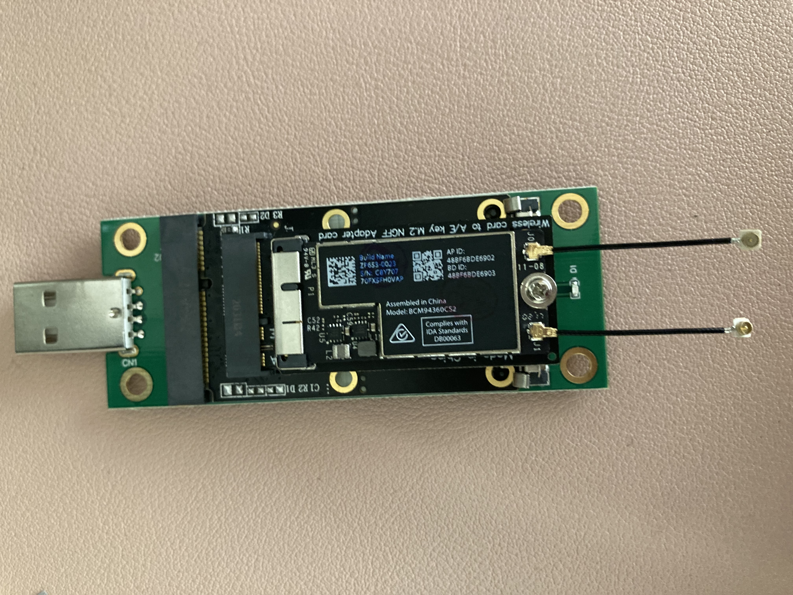

# Samsung ATIV One 5 DM500A2J-K26L Hackintosh

## System specification
| Item | Details |
| - | - |
| Model | Samsung ATIV One 5 DM500A2J-K26L |
| CPU | Intel Pentium 3558U |
| SSD | *TeamGroup L5 Lite 3D 240GB (Replaced)* |
| IGPU | *Intel HD Graphics (Haswell) (Disabled from UEFI setup)* |
| DGPU | Sapphire HD 7750 1GB in mini PcIe slot with EXP GDC + half-to-full mini PcIe extension card |
| Ethernet | Realtek RTL8168 Gigabit Ethernet Controller |
| Wi-Fi / Bluetooth | *RTL8812BU-B812 USB wireless adapter / BCM94360CS2 with multiple adapters to USB A (Stock devices disabled)* |
| Audio | Realtek HD Audio ALC282 |
| SD Card Reader | *Realtek USB Card Reader RTS5129 (Limited support)* |
| UEFI BIOS | Aptio Setup Utility P05AEK |
 
## Issues
1. Apple dropped support for Atheros Wi-Fi since Mojave and AR9565 / AR3012 is not natively supported. You can activate Wi-Fi on Mojave and higher OS using IO80211Family.kext and patched AirportAtheros40.kext from High Sierra. Install [HS80211Family.kext](https://www.insanelymac.com/forum/files/file/1008-io80211family-modif/) and the corresponding AirportAtheros40.kext for AR9565 on the bootloader for working Wi-Fi. Install zxystd's [AthBluetoothFirmware](https://github.com/zxystd/AthBluetoothFirmware) for working Bluetooth. However,
    - The Wi-Fi is very slow.
    - Continuity features do not work.
    - The card is soldered and cannot be replaced.
    - The PC's casing is blocking the Wi-Fi signal that sometimes it gets disconnected even on Windows.

    Therefore, I recommend you buy a supported USB wireless adapter. Refer to chris1111's [Wireless-USB-OC-Big-Sur-Adapter](https://github.com/chris1111/Wireless-USB-OC-Big-Sur-Adapter) for listed devices and the installation package.

2. There is no firmware uploader in macOS for the SD card reader RTS5129 as of now. Refer to [this guide](https://github.com/ManuGithubSteam/XiaoMi-Pro-2018-HackintoshOC/wiki/2.0-Setup-SD-Card-Reader) to use it through VMWare.
3. The IGPU Intel HD Graphics (Haswell) does not work well with macOS. Therefore, a compatible external graphics card is required and is to be connected via mini PcIe. Flashing a modded UEFI image or setup variables with modified Grub Shell is also required to make UEFI recognize DGPU, latter being the preferred method.
4. A GPU with GOP driver embedded VBIOS is necessary so that the user would not have to switch between `PC` mode and `HDMI` mode from UEFI Setup / OpenCore bootpicker and OS the machine booted into.
5. On non-Windows, ALC282 produces noise when the computer boots or shuts down. Disabling sound output by switching to `HDMI` mode cuts off the internal sound output which still preserves internal sound input. One may contribute by creating a layout for this machine.

## UEFI setup
### Using modded Aptio Setup Utility image
1. Learn how to flash AMI UEFI. This may brick the computer, so I don’t recommend it unless you understand the consequences and know how to unbrick in case something goes wrong.
2. [Link to the UEFI mod work](https://www.bios-mods.com/forum/Thread-Request-Unlock-Advanced-and-Chipset-tabs-on-Samsung-All-In-One-DM500A2J) Thanks to genius239 at bios-mods.com
3. Use [this](https://www.supermicro.com/en/products/motherboard/X10SLQ-L) version of Afudos which still has /GAN option to force flash.
- Note: The UEFI setup images in this repository are specifically for DM500A2J-K26L and versioned P05AEK. Please take caution when using these images or use the shell method below.

### Using modified Grub Shell
1. Dump the UEFI using the tool provided in this guide [ASUS G701VI: Unlock Hidden BIOS Settings](https://octoperf.com/blog/2018/11/20/asus-g701vi-bios-unlock/), `1. Software Tools` throgh `2.1 Dumping BIOS`.
2. Follow Dortania's [Fixing CFG Lock](https://dortania.github.io/OpenCore-Post-Install/misc/msr-lock.html) to learn how to find `CFG Lock` register offset and how to use `setup_var`. You can use the same method to also find `Primary Display` offsets.
3. Find `CFG Lock` and `Primary Display` offsets and their setup values.
4. If the DGPU supports UEFI, select `PCIe` in `Primary Display`. If it doesn’t, try updating the VBIOS with Gop driver and select the same option. If the update is limited, set `IGFX` as primary.
    - You will need to switch the monitor's `Source` and set `PC` mode to get into UEFI setup and OpenCore bootpicker if `IGFX` is primary.
5. Disable `CFG Lock`.

## Updating VBIOS with GOP driver
1. Follow the directions found in [this](https://www.win-raid.com/t892f16-AMD-and-Nvidia-GOP-update-No-requests-DIY.html) thread.
- Note: The ROM images in this repository are specifically for Sapphire HD 7750 1GB with device-id 1002:683F and subsystem-id 174B:E213. Follow the update method for your own card.

## Other models
If you have a variant such as DM500A2J-K30D, K32D, or K38D, you will notice that the CPU is an i3 model. Lucky you. A lot of fun things could be done.
    - Delete the kernel patch `Fake CPUID` and enjoy native power management and advanced CPU features.
    - Inject a working `ig-platform-id` and `SSDT-PNLF` found in OpenCorePkg bundle for working iGPU QE/CI and native brightness control. Test the HDMI-out and configure the framebuffer.
    - Change `SMBIOS` to iMac14,4 which is an iGPU-only model. You can update to Big Sur with no problem. You still have DRM and sound noise issues.
    - Insert BCM94360 variants into mini PCIe. There are three antennas on the mainboard: two from Atheros AR9565 / AR3012 and one from TV Tuner Card originally on mini PcIe slot. All share the form factor of U.FL. Although there are many other options, I would recommend BCM94360NG with mini PCIe to M.2 A+E key adapter, so that both Wi-Fi and Bluetooth are natively supported with full Apple Airport features.
    - Study and create an AppleALC layout and fix sound noise.

## Bluetooth enhancement
Atheros AR3012 Bluetooth works okay with Ath3kBT.kext. However, I had a leftover Apple's BCM94360CS2 which can be made to be connected to USB ports on the machine. I bought Apple Airport card to M.2 A+E key adapter, mini PCIe to M.2 A+E key adapter, and mini PCIe WWAN to USB adapter, and the Bluetooth works the same way as in a real Mac.

Another option with BCM94360NG is mentioned in the previous point.

## Credits
Apple for macOS

The Acidanthera team for OpenCore and kexts

Other great contributors I have yet to mention
